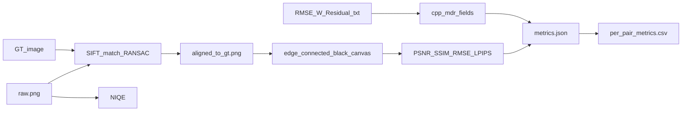

# HD3D 数据集 GES-GSP 拼接与对比计划

## 背景与现状

**数据集** [`D:\HD3D_Dataset`](D:\HD3D_Dataset)：扁平布局，13 个场景（Indoor_001–007、Outdoor_001–006），每场景 4 张输入图 + 1 张 GT（`*_gt.jpg`）。

**基准任务**：每场景 4 选 2 共 6 个图像对（pair_id: `12, 13, 14, 23, 24, 34`），总计 **78 次双视图拼接**。

**已有基础设施**（无需重建）：
- [`D:\HD3D_Result\_work\manifest.json`](D:\HD3D_Result\_work\manifest.json)：78 对的元数据（源图路径、GT、graph、输出目录）
- [`D:\HD3D_Result\_work\graphs\`](D:\HD3D_Result\_work\graphs\)：每对 2 图线性 STITCH-GRAPH（`center_image_index=0`，单边 `0→1`）
- 4 种基线方法结果：`traditional`、`obj_gsp`、`depth_gsp`、`nis_depths`（[`per_pair_metrics.csv`](D:\HD3D_Result\per_pair_metrics.csv) 共 312 行）

**缺失项**：
- `_work\pairs\` 目录已被清理，需按 manifest 重新物化输入
- 本仓库无 HD3D 批跑/评估脚本（基线由外部流水线生成）
- `ges_gsp` 结果尚未写入

**可执行文件**：[`build/Release/ges_gsp.exe`](C:/Users/22499/Documents/GitHub/GES-GSP-Stitching/build/Release/ges_gsp.exe) 已存在。

---

## 目标输出结构

与现有方法保持一致，方法标识为 **`ges_gsp`**（CLI `--method ges-gsp`，结果后缀 `GES-GSP_`）：

```text
D:\HD3D_Result\
├── {Scene}\pair_{id}\ges_gsp\
│   ├── raw.png                  # 拼接原图
│   ├── aligned_to_gt.png        # SIFT+RANSAC 对齐到 GT
│   ├── valid_mask.png
│   ├── metrics.json
│   ├── method_status.json
│   ├── run.log / error.log
├── _work\ges_gsp\
│   ├── 0_results\{pair}-result\{pair}-GES-GSP_.png
│   └── 1_debugs\{pair}-result\  # RMSE / W_Residual
├── per_pair_metrics.csv         # 追加 78 行 ges_gsp
├── summary_all.csv              # 新增 ges_gsp 汇总行
└── report.md                    # 新增 GES-GSP 对比行
```

`metrics.json` 字段与现有行一致（见 [`Outdoor_006/pair_12/obj_gsp/metrics.json`](D:\HD3D_Result\Outdoor_006\pair_12\obj_gsp\metrics.json)），其中：
- `mdr`：对齐 GT 的 RANSAC 重投影 RMSE（像素）
- `cpp_mdr` / `cpp_warping_*`：来自 C++ debug 文件（[`evaluate_stitchbench_ges_gsp.py`](C:/Users/22499/Documents/GitHub/GES-GSP-Stitching/tools/evaluate_stitchbench_ges_gsp.py) 中 `parse_rmse` / `parse_warping` 可复用）
- `niqe` / `psnr` / `ssim` / `lpips` / `rmse`：在 valid mask 内计算

---

## 实现方案

### 1. 新增 `tools/prepare_hd3d_pairs.py`

- 读取 `manifest.json`（或从 `D:\HD3D_Dataset` 重新生成 manifest）
- 为每对创建 `D:\HD3D_Result\_work\pairs\{pair_name}\`，硬链接/复制 `left_source`、`right_source`（排除 `*_gt.jpg`）
- 确认 graph 文件存在（已有则跳过）
- 写出 `datasets.txt`（78 个 pair 名）

### 2. 新增 `tools/run_hd3d_ges_gsp.ps1`

基于 [`tools/run_stitchbench_ges_gsp.ps1`](C:/Users/22499/Documents/GitHub/GES-GSP-Stitching/tools/run_stitchbench_ges_gsp.ps1) 精简适配 HD3D：

| 参数 | 值 |
|------|-----|
| `--data-root` | `D:\HD3D_Result\_work\pairs` |
| `--graph-root` | `D:\HD3D_Result\_work\graphs` |
| `--output-root` | `D:\HD3D_Result\_work\ges_gsp` |
| `--method` | `ges-gsp` |
| `--content-weight` | `1.5`（与 StitchBench 默认一致） |
| `--max-target-megapixels` | `80`（主运行） |

关键逻辑：
- 遍历 manifest 中 78 对，逐对调用 `ges_gsp.exe`
- **启用 `AutoMegapixelFallback`**（80 → 1500 MP）：`traditional` 曾在 `Indoor_003_p14`、`Outdoor_002_p23` 因画布过大失败，GES-GSP 可能同样触发
- 记录 `run_metadata.csv`（dataset、status、runtime、exit_code、megapixel_limit）
- 成功后将 `0_results\...\*-GES-GSP_.png` 复制为 `{final_pair_dir}\ges_gsp\raw.png`
- 支持 `-Dataset` 单对调试、`-SkipExistingResults` 断点续跑

### 3. 新增 `tools/evaluate_hd3d.py`

HD3D 专用评估器（本仓库当前无此脚本，需新建）：



实现要点（与 [`report.md`](D:\HD3D_Result\report.md) 描述对齐）：
1. **GT 对齐**：OpenCV SIFT + BFMatcher + RANSAC 单应性，将 `raw.png` 变换到 GT 分辨率 → `aligned_to_gt.png`
2. **Valid mask**：`edge_connected_black_canvas`——从画布边缘 flood-fill 黑色区域，取反后与 aligned 非黑区域求交
3. **指标**：`mdr`（对齐 inlier 重投影误差）、`psnr`/`ssim`/`rmse`（mask 内）、`niqe`（raw）、`lpips`（pyiqa `lpips`，max_side=1024）
4. **C++ 指标**：从 `_work\ges_gsp\1_debugs\...` 解析 `cpp_mdr`、`cpp_warping_residual_avg/sd`
5. **写出** `metrics.json`、`method_status.json`

**一致性校验**（实现后先做）：对 1–2 个已有 `traditional` 结果用同一评估代码重算，与 CSV 中已有值对比（允许微小浮点差）；通过后再批量评估 `ges_gsp`。

### 4. 更新汇总 CSV 与报告

在 `evaluate_hd3d.py` 末尾或独立 `tools/summarize_hd3d.py`：

- **`per_pair_metrics.csv`**：保留现有 312 行，追加 78 行 `ges_gsp`（若重跑则替换同 scene+pair+method 行）
- **`summary_all.csv`**：按 method 聚合 mean/median（列结构与现有一致），新增 `ges_gsp` 行
- **`report.md`**：在对比表中插入 GES-GSP 行，并输出与 4 种基线的排名对比（MDR↓、PSNR↑、SSIM↑、LPIPS↓、RMSE↓、NIQE↓、Runtime）

当前基线参考（[`summary_all.csv`](D:\HD3D_Result\summary_all.csv)）：

| Method | Success | Mean MDR | Mean PSNR | Mean SSIM | Mean LPIPS | Mean RMSE | Mean NIQE | Mean Runtime |
|--------|---------|----------|-----------|-----------|------------|-----------|-----------|--------------|
| traditional | 76/78 | 0.947 | 30.19 | 0.903 | 0.053 | 8.55 | 3.68 | 4.10s |
| nis_depths | 78/78 | 1.190 | 26.43 | 0.792 | 0.138 | 12.59 | 8.15 | 5.94s |
| depth_gsp | 78/78 | 2.031 | 19.13 | 0.612 | 0.220 | 30.36 | 6.41 | 1.75s |
| obj_gsp | 78/78 | 2.522 | 18.22 | 0.578 | 0.255 | 32.99 | 7.38 | 2.55s |

---

## 执行命令（确认计划后）

```powershell
# 1. 物化输入对
python tools/prepare_hd3d_pairs.py `
  --dataset-root D:\HD3D_Dataset `
  --result-root D:\HD3D_Result

# 2. 批量拼接（可先 Smoke 单对）
.\tools\run_hd3d_ges_gsp.ps1 -Dataset Indoor_001_p12
.\tools\run_hd3d_ges_gsp.ps1

# 3. 评估 + 更新 CSV/报告
python tools/evaluate_hd3d.py `
  --result-root D:\HD3D_Result `
  --method ges_gsp `
  --update-summary
```

---

## 依赖与环境

- **C++**：VS 2022 + OpenCV（已有 build）
- **Python**：`pyiqa`（已有）、`opencv-python`、`scikit-image`、`torch`；LPIPS 通过 `pyiqa.create_metric("lpips")`（无需单独 `lpips` 包）
- **预估耗时**：78 对 × 约 2–6 分钟/对 ≈ **3–8 小时**（取决于图像分辨率与是否触发 megapixel fallback）

---

## 风险与应对

| 风险 | 应对 |
|------|------|
| 画布超过 80 MP | AutoMegapixelFallback 至 1500 MP |
| 评估脚本与基线不完全一致 | 先用 traditional 结果做对齐校验 |
| `_work\pairs` 缺失 | `prepare_hd3d_pairs.py` 从 manifest 重建 |
| 个别 pair 拼接失败 | 记录 failure_reason，summary 中计入 failures，不阻断其余对 |

---

## 主要改动文件（本仓库）

| 文件 | 作用 |
|------|------|
| [`tools/prepare_hd3d_pairs.py`](C:/Users/22499/Documents/GitHub/GES-GSP-Stitching/tools/prepare_hd3d_pairs.py) | 物化 78 对输入 + manifest |
| [`tools/run_hd3d_ges_gsp.ps1`](C:/Users/22499/Documents/GitHub/GES-GSP-Stitching/tools/run_hd3d_ges_gsp.ps1) | 批跑 GES-GSP |
| [`tools/evaluate_hd3d.py`](C:/Users/22499/Documents/GitHub/GES-GSP-Stitching/tools/evaluate_hd3d.py) | GT 对齐、指标、CSV/报告更新 |

不修改 C++ 核心算法代码；仅新增 HD3D 实验编排脚本。
